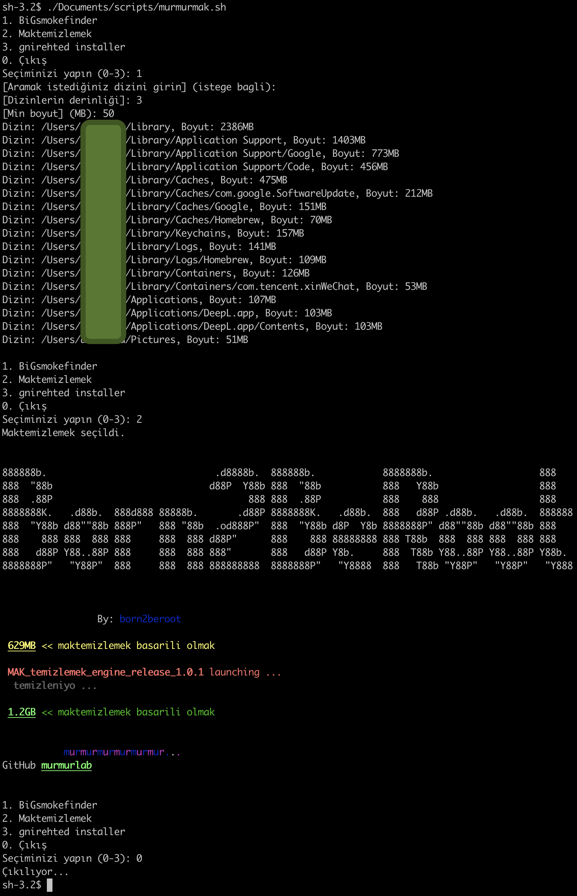

```mathematica
888888b.                              .d8888b.  888888b.            8888888b.                   888   ©
888  "88b                            d88P  Y88b 888  "88b           888   Y88b                  888    
888  .88P                                   888 888  .88P           888    888                  888    
8888888K.   .d88b.  888d888 88888b.       .d88P 8888888K.   .d88b.  888   d88P .d88b.   .d88b.  888888 
888  "Y88b d88" 88b 888P"   888 "88b  .od888P"  888  "Y88b d8P  Y8b 8888888P" d88 "88b d88 "88b 888    
888    888 888  888 888     888  888 d88P"      888    888 88888888 888 T88b  888  888 888  888 888    
888   d88P Y88..88P 888     888  888 888"       888   d88P Y8b.     888  T88b Y88..88P Y88..88P Y88b.  
8888888P"   "Y88P"  888     888  888 888888888  8888888P"   "Y8888  888   T88b "Y88P"   "Y88P"   "Y888 
```


<!--  -->
---

# murmurLAB© scripts pack

installation

```bash
git clone https://github.com/murmurlab/scripts.git ~/.murmurmak ; sh ~/.murmurmak/murmurmak.sh i
```

---

- ## big file finder 1)

    > Lists directories in the given directory with a size greater than the given size up to the given depth
    .
    

- ## mac storage cleaner 2)

    program/command removes:
  - the Trash contents.
  - 42 caches from Library and Home directories.
  - Chrome Caches.
  - VSCode Caches and its workspaces cache storage.
  - Social Media Apps Caches, like Slack and Discord.
  - FileSystems which are located in browsers profiles directories, such as Chrome and Chromium.
  
  https://github.com/ombhd/Cleaner_42

- ## recovery 42 disk (mount disk) 3)

    ! Attention You're responsible !
    \
    **fix this**
    > Login hook
    >>Failed to find an iSCSI volume with the right name
    >---------------------------------------------| OK |

- ## install sleepwipe 4)
    >
    >sleepwipe is alternative to caffeinate

    ```none
    NAME
                    sleepwipe -- prevent the system from sleeping on behalf of a utility
    SYNOPSIS
                    sleepwipe [-a] [-t timeout]
    DESCRIPTION
                    sleepwipe prevents the system from going to sleep based on specific events.
                    If no events are specified, the sleep prevention is activated indefinitely.
                    A helper event can be specified to perform actions based on that event; for example,
                    waiting for the exit status of a given process ID and reactivating sleep when it exits.
                    Available options:
                    -t              This event prevents the system from going to sleep for the given value (in seconds).
                                    It returns an error if no value is specified.
                    -p              This event prevents the system from going to sleep until the given process ID exits.
                                    If no process ID is specified, an error is thrown.
                    -k              Do not block the computer sleep feature unless you click on some specific keys of
                                    the keyboard and the mouse.
    Currently Unavailable
                    -k, key, keyboard
    ```

    oss https://github.com/fleizean/sleepwipe

- ## .zlogin 5)

    autorun config of frequently used settings for login event

  - enable dark mode
  - set "code" cmd

- ## matrix 6)
    >
    >start bit matris view within sleepwipe

    ```py
    $>
    0101010101010101001010101010101010
    0101010101010101001010101010101010
    0101010101010101001010101010101010
    0101010101010101001010101010101010
    0101010101010101001010101010101010
    0101010101010101001010101010101010
    0101010101010101001010101010101010
    0101010101010101001010101010101010
    0101010101010101001010101010101010
    0101010101010101001010101010101010
    0101010101010101001010101010101010...
    
    ```

- ## install brew 7)

    >install breö package mgr

- ## install valgrind 8)

  Valgrind is an open-source tool used for detecting memory errors and performance issues.

- ## gnirehted installer 9)

    usb debug acik olmasi gerekiyor
    bridge yi vpn olarak baglaniliyor vpn konfigurasyonlarini apk direk yapiyor (sadece vpn icin degil server da ki adb ile android de ki adb nin haberlesmesi icin gerekli adb forward, reverse komutlarini calistirmasi icin)

    detayli kullanim yazmak istemiyorum cunku program assagidaki repoda anlatilmis

    ilk kurulumda scriptteki en son satirda programi calistiriyor tekrar calistirmak istediginizde en son satiri calistirmaniz yeterli

    kablosuz olarakta usb debug yapilabiliyor bu yuzden kablosuz olarakta ayni seyler gecerli

    tek adb server a birden fazla cihaz eklenebiliyor manuel belirtmek isterseniz gnirehtet [ip:port | serialid]

    bu sadece setup scriptidir
    gnirehtetin java versiyonu icin brewsiz java kurup calistirir

    gnirehtetin rust versiyonu 650mb civari oldugu icin indirmesi haric 30dk suruyor brew reposunda mevcuttur
    brewli javada derlemesi uzun suruyodu oyuzden derlenmis source java 8u331 indirip hizli sekilde kuruluyor

    scriptin indirdigi dosyalar adbtools java ve kaynagi assagidaki link olan programimiz

    https://github.com/Genymobile/gnirehtet
    \
    \
    ss


\
\
<a href="https://www.linkedin.com/company/born2beroot/">

</a>

admin@born2beroot.com https://github.com/Born2beRoot 

<a href="https://www.linkedin.com/company/born2beroot/">Linkedln born2beroot©</a> & <a href="https://www.born2beroot.com/">born2beroot.com ©</a>