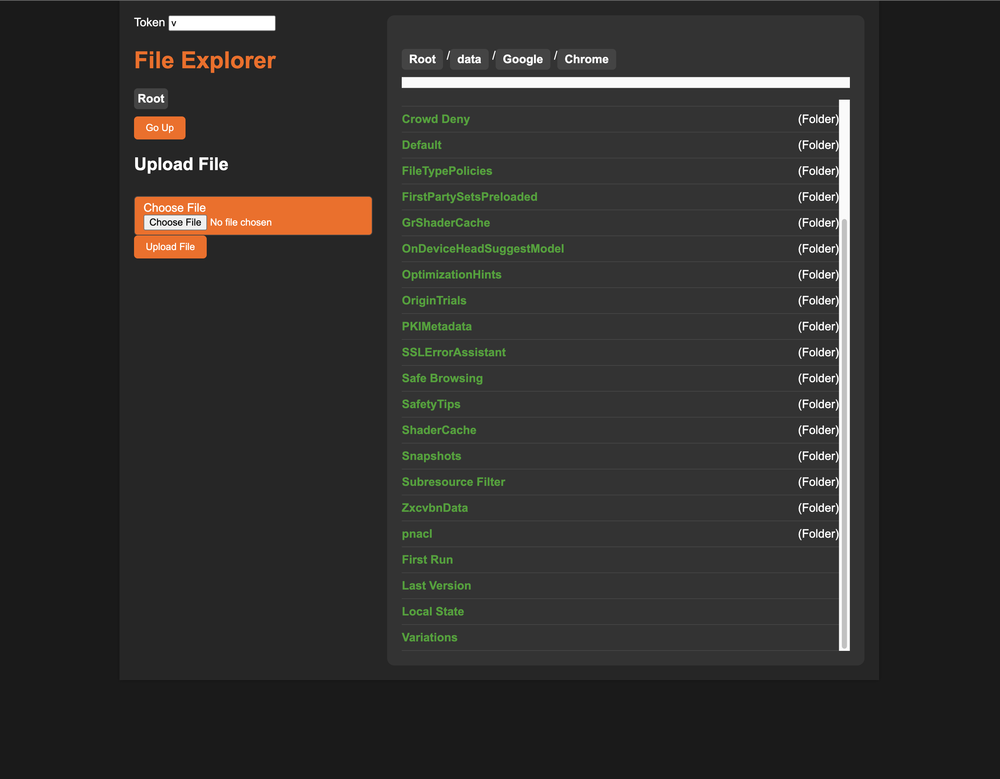
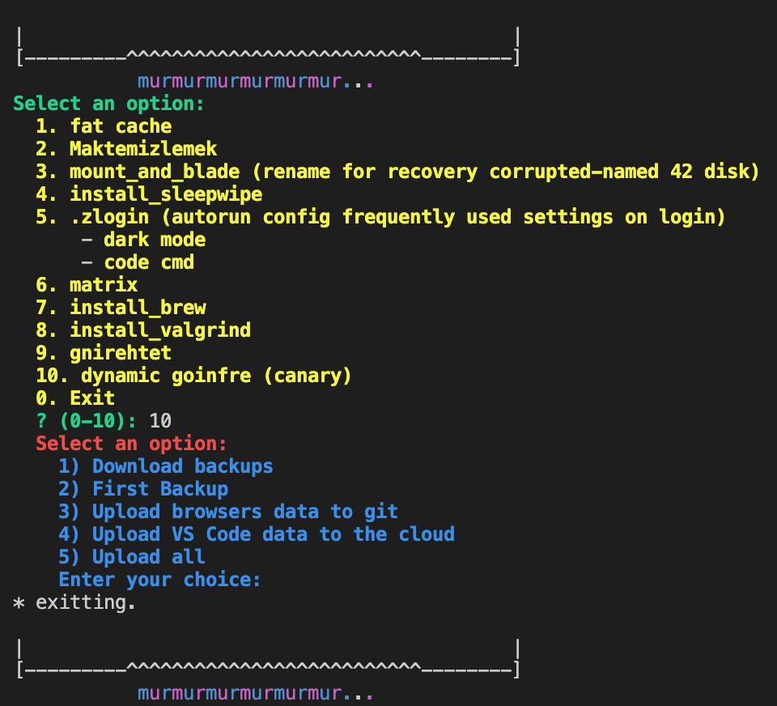
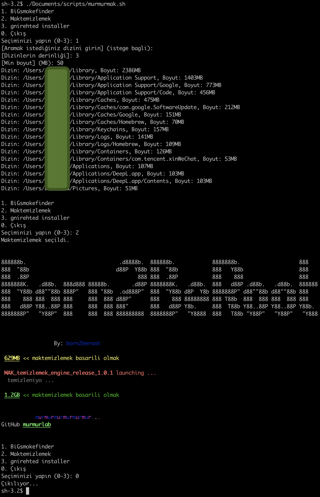

```mathematica
Authors; murmur Feathea reepNao

888888b.                              .d8888b.  888888b.            8888888b.                   888   
888  "88b                            d88P  Y88b 888  "88b           888   Y88b                  888    
888  .88P                                   888 888  .88P           888    888                  888    
8888888K.   .d88b.  888d888 88888b.       .d88P 8888888K.   .d88b.  888   d88P .d88b.   .d88b.  888888 
888  "Y88b d88" 88b 888P"   888 "88b  .od888P"  888  "Y88b d8P  Y8b 8888888P" d88 "88b d88 "88b 888    
888    888 888  888 888     888  888 d88P"      888    888 88888888 888 T88b  888  888 888  888 888    
888   d88P Y88..88P 888     888  888 888"       888   d88P Y8b.     888  T88b Y88..88P Y88..88P Y88b.  
8888888P"   "Y88P"  888     888  888 888888888  8888888P"   "Y8888  888   T88b "Y88P"   "Y88P"   "Y888 
```

<!--  -->
---

# murmurBOX scripts pack

installation | update

```bash
git clone https://github.com/murmurlab/scripts.git ~/.murmurbox ; bash ~/.murmurbox/murmurbox.bash

```

alternative installation

```bash
curl -sSL https://raw.githubusercontent.com/murmurlab/scripts/master/murmurbox.bash |bash
```

uninstallation

```bash
rm -fr ~/.murmurbox
```

---

- ## NEW! web ftp explorer (canary) 12)

  Similar to FTP Server opened from the web: LAN/WAN file manager
  

- ## NEW! dynamic goinfre (canary) 10)

    **select for first-setup 2) then,**

    > MSVSCode backups are made to Google Drive via skicka. If skicka does not work, you cannot make MSVSCode backups.
    To make skicka work, you need to create a project in console.cloud.google.com, select First Backup 2), and after the process is finished, enter the client ID and client secret in ~/.skicka.config. Then, in the APIs & Services section, open the Google Drive API in the Enabled APIs & services section. Then, in the OAuth consent screen section, you need to either publish the application or add yourself.
    Finally, do not forget to remove the comment line in SKICKA CONFIG.
  
    Store your VS Code and browsers' data on '/goinfre' for a smoother and faster experience."

  - Select 1: Download Backups

    The user is asked for a Git repository address and the necessary checks are performed.
    If brew is not installed, Homebrew, go and go skicka tool are installed.
    Backups are downloaded.
    The necessary files for Microsoft Edge, Google Chrome and msvscode are downloaded and extracted.
    Aliases are created for browsers if they do not exist.
    >msvscode | google-chrome can be opened by typing kode | chrome in the terminal.

  - Seçenek 2: First Backups
  
    The user's MSVSCode and browser data are backed up to the Git repository and the cloud.

  - Seçenek 3: Uploading Browser Data to Git

   All browser data is added to and backed up to the Git repository.

  - Seçenek 4: Uploading VS Code Data to the Cloud

    VS Code data is backed up and uploaded to the cloud using skicka.

- ## big file finder 1)

    > Lists directories in the given directory with a size greater than the given size up to the given depth
    .
    

- ## mac storage cleaner 2)

    program/command removes:
  - the Trash contents.
  - 42 caches from Library and Home directories.
  - Chrome Caches.
  - VSCode Caches and its workspaces cache storage.
  - Social Media Apps Caches, like Slack and Discord.
  - FileSystems which are located in browsers profiles directories, such as Chrome and Chromium.
  
  https://github.com/ombhd/Cleaner_42

- ## recovery 42 disk (mount disk) 3)

    ! Attention You're responsible !
    \
    **fix this**
    > Login hook
    >>Failed to find an iSCSI volume with the right name
    >---------------------------------------------| OK |

- ## install sleepwipe 4)
    >
    >sleepwipe is alternative to caffeinate

    ```none
    NAME
                    sleepwipe -- prevent the system from sleeping on behalf of a utility
    SYNOPSIS
                    sleepwipe [-a] [-t timeout]
    DESCRIPTION
                    sleepwipe prevents the system from going to sleep based on specific events.
                    If no events are specified, the sleep prevention is activated indefinitely.
                    A helper event can be specified to perform actions based on that event; for example,
                    waiting for the exit status of a given process ID and reactivating sleep when it exits.
                    Available options:
                    -t              This event prevents the system from going to sleep for the given value (in seconds).
                                    It returns an error if no value is specified.
                    -p              This event prevents the system from going to sleep until the given process ID exits.
                                    If no process ID is specified, an error is thrown.
                    -k              Do not block the computer sleep feature unless you click on some specific keys of
                                    the keyboard and the mouse.
    Currently Unavailable
                    -k, key, keyboard
    ```

    oss https://github.com/fleizean/sleepwipe

- ## .zlogin 5)

    autorun config of frequently used settings for login event

  - enable dark mode
  - set "code" cmd

- ## matrix 6)
    >
    >start bit matris view within sleepwipe

    ```py
    $>
    0101010101010101001010101010101010
    0101010101010101001010101010101010
    0101010101010101001010101010101010
    0101010101010101001010101010101010
    0101010101010101001010101010101010
    0101010101010101001010101010101010
    0101010101010101001010101010101010
    0101010101010101001010101010101010
    0101010101010101001010101010101010
    0101010101010101001010101010101010
    0101010101010101001010101010101010...
    
    ```

- ## install brew 7)

    >install brew package mgr

- ## install valgrind 8)

  Valgrind is an open-source tool used for detecting memory errors and performance issues.

- ## gnirehted installer 9)

    USB debugging must be enabled.

    The bridge is connected to the VPN as a VPN. The apk directly configures the VPN configuration (not only for VPN, but also for running adb forward and reverse commands required for communication between the adb on the server and the adb on the android).

    I do not want to write detailed usage because the program is explained in the repo below.

    The program is started in the last line of the script on the first installation. To run it again, just run the last line.

    USB debugging can also be done wirelessly, so the same things are valid for wireless.

    Multiple devices can be added to a single adb server. If you want to specify manually, gnirehtet [ip:port | serialid].

    This is just the setup script.

    It installs and runs Java without brew for the Java version of gnirehtet.

    The Rust version of gnirehtet is available in the brew repo, it takes about 30 minutes to run, excluding downloading, because it is about 650MB.

    It was taking a long time to compile Java with brew, so it is being installed quickly by downloading compiled source Java 8u331.

    The files downloaded by the script are adbtools java and the source of our program, which is the link below.

    https://github.com/Genymobile/gnirehtet
    \
    \
    ss




\
\
<a href="https://www.linkedin.com/company/born2beroot/">

</a>
